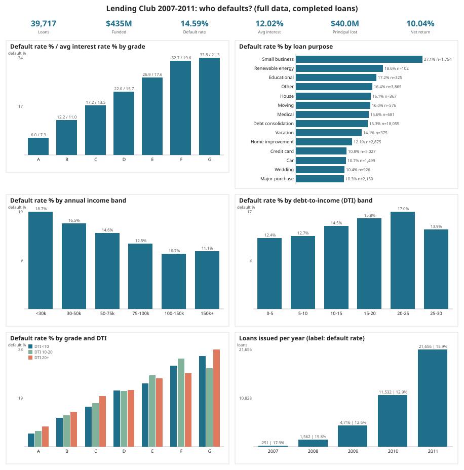
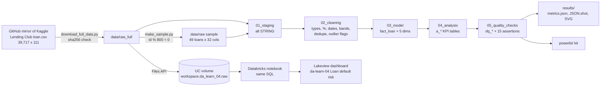

# da-learn-04 - Loan default risk (Lending Club 2007-2011)

A data analyst learning project: take the **real Lending Club loan book for 2007-2011 (39,717 loans, $435M funded)**,
clean it with numbered SQL scripts, model it as a star schema, and answer the classic credit-risk questions:
**who defaults, and does the price (interest rate) cover the risk?** The same Spark-dialect SQL runs locally on
DuckDB (full data) and on Databricks SQL (Unity Catalog + a published Lakeview dashboard). A Power BI kit and
SVG charts are included.



## Business questions
1. How does the default rate scale with Lending Club's **grade** (A-G) and sub-grade, and does the interest rate keep up?
2. Which loan **purposes** default most?
3. Does higher **income** protect against default?
4. Does **debt-to-income (DTI)** predict default, and is it still informative once grade is known?
5. How do **term**, verification status, public records and recent credit inquiries change risk?
6. How did volume and default rates evolve by **vintage** (issue year)?

Definitions: *default* = `loan_status = 'Charged Off'`. Rates are computed on **completed loans** (Fully Paid +
Charged Off = 38,577); the 1,140 `Current` loans are still running and are excluded from rates.
*Net return* = (total payments received - funded amount) / funded amount on completed loans (not annualised).

## Pipeline


## Key insights (full data, DuckDB = Databricks)
- **Grade is the dominant risk signal.** Default rate climbs monotonically from **5.99% (A)** to 12.21% (B), 17.19% (C), 21.99% (D), 26.85% (E), 32.68% (F) and **33.78% (G)**; by sub-grade from **2.63% (A1)** to **47.79% (F5)**. Average rates rise from 7.33% to 21.31%, so lower grades still earned a higher (non-annualised) net return on completed loans: 7.19% for A vs 13.04% for E and 13.92% for G.
- **Overall: 14.59% of completed loans defaulted**, writing off **$40.0M of principal (9.63% of funded)**; the book still returned **+10.04%** net of losses.
- **Purpose matters: small-business loans default at 27.08%**, almost double debt consolidation (15.33%) and 2.6x major purchase (10.33%), wedding (10.37%) or car (10.67%) loans.
- **Term is the second-strongest simple driver:** 60-month loans default at **25.31% vs 11.09%** for 36-month loans.
- **Income and DTI:** default falls from **18.70% (<$30k)** to 10.66% ($100-150k); by DTI it rises from **12.39% (DTI 0-5)** to **16.99% (20-25)**. Within grade A, DTI still separates risk (4.71% at DTI 0-5 vs 8.93% at 25-30), so DTI adds information beyond grade.
- Other signals: borrowers with a public record 22.56% vs 14.13%; 3+ inquiries in 6 months 20.46% vs 12.19% for none; counter-intuitively *Verified* income 16.80% vs 12.83% *Not verified* (Lending Club verified the riskier applications).

Full tables and caveats: [results/RESULTS.md](results/RESULTS.md).

## How to run
```bash
pip install -r requirements.txt
python scripts/download_full_data.py      # 34.8 MB into data/raw_full/ (sha256-checked)
python run_pipeline.py --source full      # sql/00-05 on DuckDB -> results/, data/clean_full/
python run_pipeline.py --source sample    # the committed 49-loan sample -> powerbi/data, results/sample/
python scripts/build_databricks.py --with-dashboard   # regenerate the notebook + .lvdash.json
```
Databricks: see [databricks/SETUP.md](databricks/SETUP.md) (upload `loan.csv` to `/Volumes/workspace/da_learn_04/raw/`,
import the notebook, Run all, import the dashboard). Power BI: [powerbi/BUILD_GUIDE.md](powerbi/BUILD_GUIDE.md).

## Repository layout
```
sql/00_duckdb_compat.sql     DuckDB-only shims for Spark functions (datediff, percentile, ...)
sql/01_staging.sql           raw CSV -> stg_loans (32 columns, all STRING)
sql/02_cleaning.sql          cln_loans: typed, standardised, deduped, bands + flags
sql/03_model.sql             fact_loan, dim_date, dim_grade, dim_purpose, dim_geography, dim_borrower
sql/04_analysis.sql          a_* KPI tables (grade, purpose, income, DTI, grade x DTI, profile, vintage, state)
sql/05_quality_checks.sql    dq_row_counts, dq_null_rates, dq_issues, dq_assertions
run_pipeline.py              DuckDB runner (+ pipeline.json config)
scripts/                     download, sample, charts (svgcharts.py), Databricks notebook/dashboard builders
data/raw/loan.csv            reproducible sample (49 loans) - see data/README.md
databricks/                  exported notebook, .lvdash.json, run outputs, DuckDB vs Databricks comparison
powerbi/                     star-schema CSVs (sample), measures.dax, model.md, dashboard_spec.md, BUILD_GUIDE.md
results/                     RESULTS.md, metrics.json, JSON.shot, charts/*.svg, sample/JSON.shot
```

## Data quality summary
39,717 raw rows -> 39,717 clean (no duplicates on `id`); `emp_length = 'n/a'` for 1,075 loans (-> Unknown);
50 missing `revol_util`; 101 `home_ownership` NONE/OTHER merged to OTHER; 537 income outliers (> Q3 + 3*IQR)
flagged but kept; all 15 assertions PASS on DuckDB and Databricks (the sample fails only the A->G monotonicity
assertion, as expected with 49 loans).

## Limitations
- 2007-2011 vintage only; underwriting changed a lot afterwards. Survivorship: Lending Club's own approval decision is baked in.
- Net return is cumulative cash-on-cash, not an annualised IRR, so 60-month loans look better than they are.
- Default rates are descriptive, not a fitted probability-of-default model.

## Complete dataset
| | |
|---|---|
| Kaggle page | https://www.kaggle.com/datasets/imsparsh/lending-club-loan-dataset-2007-2011 ("Lending Club Loan Dataset 2007-2011", originally LendingClub's public LoanStats3a export) |
| Mirror URLs | https://raw.githubusercontent.com/anushkaparadkar/lending-club-case-study/master/loan.csv (primary), https://raw.githubusercontent.com/akashkriplani/lending-club-case-study/main/loan.csv (fallback) - byte-identical, sha256 `a57286c2a5f329930c875366790c8f5291be7525b7b4e2355dcbfb2e73af6f04` |
| Licence | LendingClub public loan data; the Kaggle page does not state a formal licence - used here for non-commercial education, check the Kaggle page before redistribution |
| Total size | 34,813,575 bytes (1 CSV), 39,717 loans x 111 columns (issued Jun-2007 to Dec-2011) |
| File list | `loan.csv` (columns used: id, member_id, loan_amnt, funded_amnt, funded_amnt_inv, term, int_rate, installment, grade, sub_grade, emp_length, home_ownership, annual_inc, verification_status, issue_d, loan_status, purpose, addr_state, dti, delinq_2yrs, earliest_cr_line, inq_last_6mths, open_acc, pub_rec, revol_bal, revol_util, total_acc, total_pymnt, total_rec_prncp, total_rec_int, recoveries, pub_rec_bankruptcies) |
| Download | `pip install -r requirements.txt && python scripts/download_full_data.py` |
