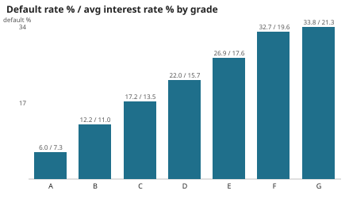
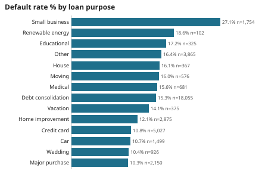
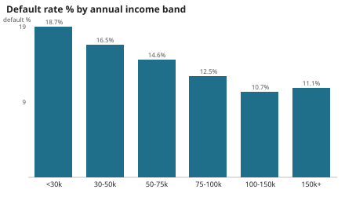
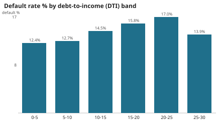
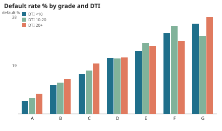
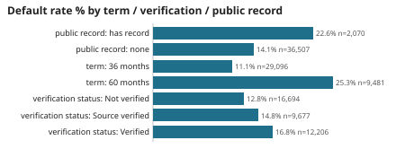
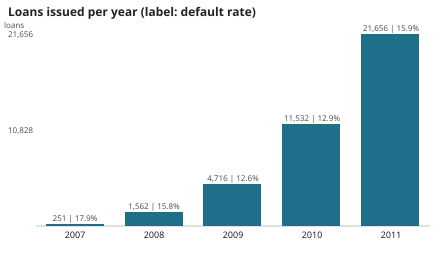

# Results - da-learn-04 Loan default risk

All numbers come from the **full** Lending Club 2007-2011 file (39,717 loans) run through `sql/01-05` on DuckDB,
and were reproduced on Databricks SQL (Serverless Starter Warehouse, schema `workspace.da_learn_04`): every core
table row count and every compared KPI table matched (`databricks/run_outputs/duckdb_vs_databricks.json`).
Machine-readable: [metrics.json](metrics.json), [JSON.shot](JSON.shot). Charts: [charts/](charts/).

## Headline
| KPI | Value |
|---|---|
| Loans / completed / current | 39,717 / 38,577 / 1,140 |
| Defaults (Charged Off) | 5,627 |
| Default rate (completed loans) | **14.59%** |
| Funded | $434,810,325 |
| Average interest rate | 12.02% |
| Median annual income / median DTI | $59,000 / 13.40 |
| Share of 60-month loans | 26.74% |
| Principal lost on defaults | $40,049,086 (9.63% of completed funded) |
| Net return on completed loans (not annualised) | +10.04% |
| Issue months | 2007-06 to 2011-12 |

## Q1 Grade
| Grade | Completed loans | Default % | Avg rate % | Net return % |
|---|---|---|---|---|
| A | 10,045 | 5.99 | 7.33 | 7.19 |
| B | 11,675 | 12.21 | 11.01 | 9.59 |
| C | 7,834 | 17.19 | 13.53 | 10.57 |
| D | 5,085 | 21.99 | 15.66 | 11.18 |
| E | 2,663 | 26.85 | 17.63 | 13.04 |
| F | 976 | 32.68 | 19.64 | 12.38 |
| G | 299 | 33.78 | 21.31 | 13.92 |

Sub-grade range: A1 2.63% -> F5 47.79%. Pricing roughly kept up with risk on a cash-on-cash basis.

## Q2 Purpose
Small business 27.08% (1,754 loans) is the clear outlier; renewable energy 18.63%, educational 17.23%, other 16.38%;
debt consolidation (47% of loans) 15.33%; safest: major purchase 10.33%, wedding 10.37%, car 10.67%, credit card 10.78%.

## Q3 Income and Q4 DTI
| Income band | Loans | Default % |   | DTI band | Loans | Default % |
|---|---|---|---|---|---|---|
| <30k | 3,743 | 18.70 | | 0-5 | 5,044 | 12.39 |
| 30-50k | 10,617 | 16.47 | | 5-10 | 7,861 | 12.73 |
| 50-75k | 11,911 | 14.62 | | 10-15 | 9,624 | 14.54 |
| 75-100k | 6,327 | 12.53 | | 15-20 | 8,824 | 15.80 |
| 100-150k | 4,270 | 10.66 | | 20-25 | 6,599 | 16.99 |
| 150k+ | 1,709 | 11.06 | | 25-30 | 625 | 13.92 |

The 25-30 DTI band is small and priced lower (avg rate 9.52%), i.e. Lending Club only approved strong borrowers at
that DTI. Within grade A, DTI still separates risk: 4.71% (DTI 0-5) vs 8.93% (25-30).
  

## Q5 Term and borrower profile
60 months 25.31% vs 36 months 11.09%. Public record 22.56% vs none 14.13%. Inquiries in last 6 months: 0 = 12.19%,
1 = 15.73%, 2 = 16.68%, 3+ = 20.46%. Verified 16.80%, Source verified 14.82%, Not verified 12.83%. Employment length
is flat (13.6-15.7%) except Unknown (22.07%). Home ownership: mortgage 13.67%, own 14.89%, rent 15.36%.

## Q6 Vintage
| Year | Loans | Funded | Default % | 60-month share |
|---|---|---|---|---|
| 2007 | 251 | $2.2M | 17.93 | 0% |
| 2008 | 1,562 | $13.5M | 15.81 | 0% |
| 2009 | 4,716 | $46.3M | 12.60 | 0% |
| 2010 | 11,532 | $116.6M | 12.88 | 26.59% |
| 2011 | 21,656 | $256.2M | 15.87 | 34.89% |

The 2011 rise coincides with the growing share of 60-month loans (2011 still has 1,140 loans running).

States (>= 500 completed loans): highest FL 18.12%, MO 17.01%, CA 16.19%; lowest TX 11.88%, PA/MA 12.26%.

## Data quality
15/15 assertions PASS (keys unique, all foreign keys resolve, term in {36, 60}, rate 5-25%, DTI 0-30, funded <=
requested, sub-grade consistent with grade, credit line before issue month, losses only on defaults, monotone grade
risk). Issues logged: 1,075 emp_length n/a, 50 revol_util missing, 101 NONE/OTHER ownership, 537 income outliers
(kept), 19,842 loans not fully funded by investors (informational), 4,218 charged-off loans with recoveries.

## Caveats
Descriptive rates, not a PD model; net return is not annualised; 2007-2011 only; current loans excluded from rates.
